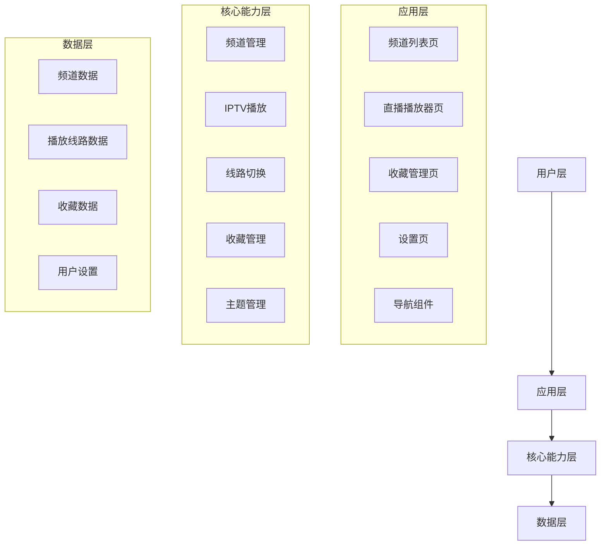
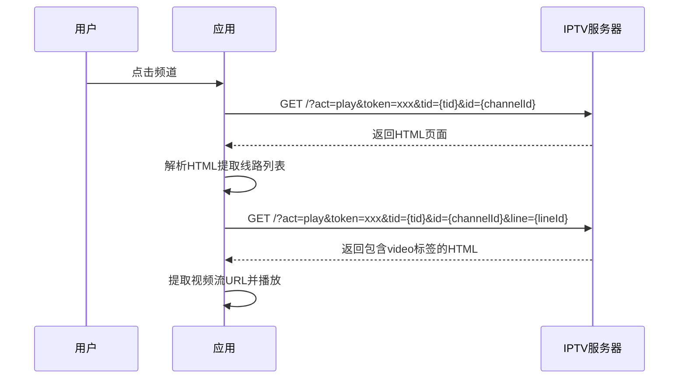

# LPTV 电视直播Web应用 - 设计规格文档

## 1. 项目概述

LPTV 是一款面向普通用户的电视直播Web应用，提供频道浏览、收藏管理、直播播放和个性化设置功能。

### 1.1 核心功能

| 模块 | 功能描述 | 对应设计图 |
|------|----------|------------|
| 频道浏览 | 展示频道列表、支持分类筛选、点击进入直播 | LPTV-频道界面-频道列表.png |
| 直播播放 | 调用外部IPTV接口、支持线路切换、全屏播放 | - |
| 收藏管理 | 已收藏频道列表、空态提示、添加/取消收藏 | LPTV-收藏界面-已收藏列表.png、LPTV-收藏界面-空态.png |
| 设置管理 | 主题切换（深色/浅色）、播放模式设置 | LPTV-设置界面-主题管理.png、LPTV-设置界面-模式管理.png |

### 1.2 技术栈

- **框架**: React 18 + TypeScript
- **构建工具**: Vite 6
- **样式**: Tailwind CSS 3
- **路由**: React Router DOM 6
- **状态管理**: React Context + useReducer

---

## 2. 架构设计

### 2.1 架构图



### 2.2 目录结构

```
src/
├── components/           # 可复用组件
│   ├── Layout/          # 布局组件
│   │   └── Header.tsx
│   ├── Channel/         # 频道相关组件
│   │   ├── ChannelCard.tsx
│   │   └── ChannelList.tsx
│   ├── Player/          # 播放器组件
│   │   ├── IPTVPlayer.tsx
│   │   ├── ChannelLineList.tsx
│   │   └── index.ts
│   ├── Favorite/        # 收藏相关组件
│   │   ├── FavoriteCard.tsx
│   │   ├── FavoriteList.tsx
│   │   └── EmptyState.tsx
│   └── Settings/        # 设置相关组件
│       ├── ThemeSetting.tsx
│       └── ModeSetting.tsx
├── pages/               # 页面组件
│   ├── ChannelPage.tsx
│   ├── PlayerPage.tsx
│   ├── FavoritePage.tsx
│   └── SettingsPage.tsx
├── hooks/               # 自定义hooks
│   └── useFavorites.ts
├── context/             # Context状态管理
│   └── AppContext.tsx
├── types/               # TypeScript类型
│   └── index.ts
├── data/                # 模拟数据
│   └── channels.ts
├── utils/               # 工具函数
│   └── iptv.ts
├── App.tsx
├── main.tsx
└── index.css
```

---

## 3. 核心数据模型

### 3.1 频道数据

```typescript
interface Channel {
  id: string;
  name: string;
  logo: string;
  category: string;
  currentProgram: string;
  isLive: boolean;
  tid: 'ws' | 'ys';  // 卫视/影视分类
}
```

### 3.2 播放线路数据

```typescript
interface ChannelLine {
  id: string;           // 线路ID
  name: string;         // 线路名称（如：线路1、高清线路）
  url: string;          // 视频流URL
  quality: string;      // 画质标识（高清/标清）
  isActive?: boolean;   // 是否当前选中
}
```

### 3.3 用户设置

```typescript
interface UserSettings {
  theme: 'dark' | 'light';
  autoPlay: boolean;
  quality: 'high' | 'medium' | 'low';
}
```

---

## 4. 路由配置

| 路径 | 页面组件 | 功能描述 |
|------|----------|----------|
| `/` | ChannelPage | 频道列表页（首页） |
| `/player/:tid/:channelId` | PlayerPage | 直播播放器页 |
| `/favorites` | FavoritePage | 收藏管理页 |
| `/settings` | SettingsPage | 设置页 |

---

## 5. 页面设计

### 5.1 频道列表页

**布局结构**:
- 顶部：Logo + 搜索框 + 分类筛选（卫视/影视）
- 主体：频道卡片网格列表
- 频道卡片：Logo + 名称 + 当前节目 + 直播标识

### 5.2 直播播放器页

**布局结构**:
- 顶部：返回按钮 + 频道名称 + 当前节目
- 主体：视频播放区域（占全屏）
- 底部：线路切换列表（横向滚动）

**播放器布局图**:
```
┌─────────────────────────────────────────────────────────┐
│  [◀ 返回] 频道名称 - 当前节目                           │
├─────────────────────────────────────────────────────────┤
│                                                         │
│              <video id="vstPlayer">                     │
│                   ↓ 视频内容                             │
│              </video>                                   │
│                                                         │
├─────────────────────────────────────────────────────────┤
│  线路选择:                                              │
│  ┌──────┬──────┬──────┬──────┬──────┐                  │
│  │  线路1│  线路2│  线路3│  线路4│  线路5│              │
│  └──────┴──────┴──────┴──────┴──────┘                  │
└─────────────────────────────────────────────────────────┘
```

### 5.3 收藏管理页

**布局结构**:
- 顶部：标题 + 返回按钮
- 主体：已收藏频道列表 / 空态提示
- 支持取消收藏操作

### 5.4 设置页

**布局结构**:
- 顶部：标题 + 返回按钮
- 主体：
  - 主题管理：深色/浅色模式切换
  - 模式管理：自动播放开关、画质选择

---

## 6. IPTV播放器设计

### 6.1 播放流程



### 6.2 核心API调用

| API | 说明 | 参数 |
|-----|------|------|
| `https://iptv345.com/?act=play&token=xxx&tid={tid}&id={channelId}` | 获取播放页面 | tid: ws/ys, channelId: 频道ID |
| `https://iptv345.com/?act=play&token=xxx&tid={tid}&id={channelId}&line={lineId}` | 获取指定线路播放页面 | 同上 + lineId: 线路ID |

### 6.3 视频流提取逻辑

```typescript
// 从HTML中提取视频流URL
const parseVideoUrl = (html: string): string | null => {
  const videoMatch = html.match(/<video[^>]+src="([^"]+)"/);
  return videoMatch ? videoMatch[1] : null;
};

// 解析线路列表
const parseChannelLines = (html: string): ChannelLine[] => {
  const lines: ChannelLine[] = [];
  const linePattern = /data-line="(\d+)"[^>]*>([^<]+)/g;
  let match;
  while ((match = linePattern.exec(html)) !== null) {
    lines.push({
      id: match[1],
      name: match[2].trim(),
      url: '',
      quality: '',
      isActive: false
    });
  }
  return lines.length > 0 ? lines : [
    { id: '1', name: '默认线路', url: '', quality: '高清', isActive: true }
  ];
};
```

---

## 7. 移动端适配设计

### 7.1 响应式断点策略

| 设备类型 | 屏幕宽度 | 布局策略 |
|----------|----------|----------|
| 手机端 | < 768px | 紧凑布局，简化控件，触摸友好 |
| 平板端 | 768px - 1024px | 中等布局，保留核心功能 |
| 桌面端 | > 1024px | 完整布局，全部功能 |

### 7.2 移动端布局特点

| 特性 | 移动端适配策略 |
|------|----------------|
| **按钮尺寸** | 最小触摸区域 44px × 44px |
| **间距** | 增大内边距和外边距 |
| **字体** | 增大字体大小（16px+） |
| **交互** | 触摸友好，避免悬停效果 |
| **导航** | 简化顶部信息栏 |
| **安全区域** | 适配刘海屏、底部安全区域 |

### 7.3 移动端交互优化

- **触摸手势**: 点击屏幕显示/隐藏控制栏
- **自动隐藏**: 播放时3秒无操作自动隐藏控制栏
- **内联播放**: 使用 `playsinline` 属性支持内联播放

### 7.4 响应式样式要点

```css
/* 移动端 */
@media (max-width: 768px) {
  .player-header { padding: 16px; min-height: 60px; }
  .back-btn { width: 44px; height: 44px; padding: 0; }
  .line-item { padding: 12px 20px; min-width: 72px; height: 44px; }
  .line-switcher { padding-bottom: calc(16px + env(safe-area-inset-bottom)); }
}

/* 平板端 */
@media (min-width: 768px) and (max-width: 1024px) {
  .player-header { padding: 14px 20px; }
  .line-item { padding: 10px 18px; }
}

/* 桌面端 */
@media (min-width: 1024px) {
  .player-container { max-width: 1920px; margin: 0 auto; }
  .line-item { transition: all 0.2s; }
}
```

---

## 8. 设计风格

- **主题**: 深色主题为主（适合直播观看），集成液态玻璃效果
- **布局**: 卡片式布局，清晰展示信息
- **响应式**: 支持桌面端和移动端
- **交互**: 触摸友好，简洁直观

---

## 9. 液态玻璃主题设计

### 9.1 液态玻璃效果核心原理

液态玻璃（Liquid Glass）效果融合了毛玻璃（Glassmorphism）和动态流体特性：

| 特性 | CSS实现 | 效果描述 |
|------|----------|----------|
| **背景模糊** | `backdrop-filter: blur(20px)` | 模拟玻璃的透光模糊 |
| **半透明背景** | `background: rgba(255,255,255,0.1)` | 半透明磨砂质感 |
| **边框发光** | `box-shadow: 0 0 30px rgba(255,255,255,0.3)` | 玻璃边缘发光 |
| **内发光** | `box-shadow: inset 0 0 20px rgba(255,255,255,0.1)` | 内部柔光效果 |

### 9.2 Tailwind CSS 配置

```javascript
// tailwind.config.js
module.exports = {
  theme: {
    extend: {
      colors: {
        glass: {
          50: 'rgba(255, 255, 255, 0.05)',
          100: 'rgba(255, 255, 255, 0.1)',
          200: 'rgba(255, 255, 255, 0.2)',
          300: 'rgba(255, 255, 255, 0.3)',
        }
      },
      backdropBlur: {
        xs: '2px',
        sm: '4px',
        md: '8px',
        lg: '16px',
        xl: '24px',
        '2xl': '40px',
      },
      boxShadow: {
        glass: '0 8px 32px rgba(0, 0, 0, 0.3), inset 0 0 20px rgba(255, 255, 255, 0.05)',
        'glass-glow': '0 0 30px rgba(100, 200, 255, 0.3), 0 8px 32px rgba(0, 0, 0, 0.3)',
      }
    }
  }
};
```

### 9.3 液态玻璃工具类

```css
/* src/index.css */
@layer utilities {
  .glass-panel {
    background: rgba(255, 255, 255, 0.08);
    backdrop-filter: blur(20px);
    -webkit-backdrop-filter: blur(20px);
    border: 1px solid rgba(255, 255, 255, 0.15);
    box-shadow: 
      0 8px 32px rgba(0, 0, 0, 0.3),
      inset 0 0 20px rgba(255, 255, 255, 0.05);
  }

  .glass-card {
    background: rgba(255, 255, 255, 0.06);
    backdrop-filter: blur(16px);
    -webkit-backdrop-filter: blur(16px);
    border: 1px solid rgba(255, 255, 255, 0.12);
    box-shadow: 
      0 4px 20px rgba(0, 0, 0, 0.2),
      inset 0 0 15px rgba(255, 255, 255, 0.04);
  }

  .glass-button {
    background: rgba(255, 255, 255, 0.1);
    backdrop-filter: blur(10px);
    -webkit-backdrop-filter: blur(10px);
    border: 1px solid rgba(255, 255, 255, 0.2);
    transition: all 0.3s ease;
  }

  .glass-button:hover {
    background: rgba(255, 255, 255, 0.2);
    box-shadow: 0 0 20px rgba(100, 200, 255, 0.3);
    transform: translateY(-2px);
  }

  .glass-glow {
    box-shadow: 
      0 0 40px rgba(100, 200, 255, 0.2),
      0 0 80px rgba(100, 200, 255, 0.1),
      inset 0 0 30px rgba(255, 255, 255, 0.05);
  }

  .glass-border-glow {
    position: relative;
  }

  .glass-border-glow::before {
    content: '';
    position: absolute;
    inset: -2px;
    background: linear-gradient(45deg, 
      rgba(100, 200, 255, 0.3),
      rgba(200, 100, 255, 0.3),
      rgba(100, 255, 200, 0.3));
    border-radius: inherit;
    z-index: -1;
    filter: blur(10px);
    opacity: 0;
    transition: opacity 0.3s ease;
  }

  .glass-border-glow:hover::before {
    opacity: 1;
  }

  .glass-fluid-bg {
    position: relative;
    overflow: hidden;
  }

  .glass-fluid-bg::before {
    content: '';
    position: absolute;
    top: -50%;
    left: -50%;
    width: 200%;
    height: 200%;
    background: radial-gradient(circle at 20% 80%, rgba(100, 200, 255, 0.1) 0%, transparent 50%),
                radial-gradient(circle at 80% 20%, rgba(200, 100, 255, 0.1) 0%, transparent 50%),
                radial-gradient(circle at 50% 50%, rgba(100, 255, 200, 0.05) 0%, transparent 70%);
    animation: fluidMove 20s ease-in-out infinite;
  }

  @keyframes fluidMove {
    0%, 100% { transform: translate(0, 0) rotate(0deg); }
    25% { transform: translate(5%, -5%) rotate(2deg); }
    50% { transform: translate(-5%, 5%) rotate(-2deg); }
    75% { transform: translate(-5%, -5%) rotate(2deg); }
  }
}
```

### 9.4 组件应用方案

| 组件 | 应用的玻璃效果 | 说明 |
|------|----------------|------|
| Header | `.glass-panel` | 导航头部玻璃效果 |
| ChannelCard | `.glass-card .glass-border-glow` | 频道卡片带边框发光 |
| PlayerControls | `.glass-panel` | 播放器控制栏玻璃效果 |
| FavoriteCard | `.glass-card` | 收藏卡片玻璃效果 |
| SettingsPanel | `.glass-panel` | 设置面板玻璃效果 |
| App | `.glass-fluid-bg` | 全局动态流体背景 |

### 9.5 主题适配

```css
/* 深色主题 */
.dark .glass-panel {
  background: rgba(30, 30, 40, 0.8);
  border-color: rgba(255, 255, 255, 0.1);
}

/* 浅色主题 */
.light .glass-panel {
  background: rgba(255, 255, 255, 0.7);
  border-color: rgba(0, 0, 0, 0.1);
}

### 9.6 liquid-glass-react 库集成

推荐使用 `liquid-glass-react` 库实现更逼真的液态玻璃效果：

**安装：**
```bash
npm install liquid-glass-react
```

**核心特性对比：**

| 特性 | 自定义CSS方案 | liquid-glass-react库 |
|------|---------------|---------------------|
| 毛玻璃模糊 | ✅ | ✅ |
| 半透明背景 | ✅ | ✅ |
| 动态折射效果 | ❌ | ✅ |
| 弹性交互 | ❌ | ✅ |
| 色差效果 | ❌ | ✅ |
| 多种折射模式 | ❌ | ✅ |
| 鼠标响应 | ❌ | ✅ |

**推荐配置参数：**

| 参数 | 推荐值 | 说明 |
|------|--------|------|
| `displacementScale` | 30-70 | 折射强度 |
| `blurAmount` | 0.06-0.12 | 模糊程度 |
| `saturation` | 110-140 | 饱和度 |
| `aberrationIntensity` | 1-3 | 色差强度 |
| `elasticity` | 0.1-0.35 | 弹性系数 |

**组件集成示例：**

```tsx
import LiquidGlass from 'liquid-glass-react';

// 频道卡片
<LiquidGlass
  cornerRadius={16}
  padding="16px"
  displacementScale={50}
  blurAmount={0.08}
  saturation={130}
  aberrationIntensity={1.5}
  elasticity={0.2}
>
  {/* 卡片内容 */}
</LiquidGlass>

// 播放器控制栏
<LiquidGlass
  cornerRadius={16}
  padding="16px"
  displacementScale={30}
  blurAmount={0.1}
  elasticity={0.15}
>
  {/* 控制内容 */}
</LiquidGlass>
```

**浏览器兼容性：**

| 浏览器 | 支持程度 |
|--------|----------|
| Chrome/Edge | ✅ 完全支持 |
| Safari/Firefox | ⚠️ 部分支持（位移效果不可见） |

---

## 10. 状态管理

使用 React Context + useReducer 管理全局状态：
- 收藏列表状态
- 用户设置（主题、播放模式）
- 当前选中的频道分类

---

## 11. 技术要点

1. **IPTV接口集成**: 通过解析外部IPTV网站HTML获取视频流
2. **线路切换**: 支持多条线路选择，提升播放稳定性
3. **路由懒加载**: 使用 React Router 的 lazy 和 Suspense 实现组件懒加载
4. **本地存储**: 收藏数据和用户设置持久化到 localStorage
5. **响应式设计**: Tailwind CSS 的响应式断点适配不同屏幕
6. **移动端优化**: 触摸手势支持、安全区域适配、内联播放
7. **错误边界**: 实现 React Error Boundary 处理组件异常

---

## 12. 交付物

| 文件 | 说明 |
|------|------|
| `src/App.tsx` | 主应用入口，路由配置 |
| `src/main.tsx` | 应用启动文件 |
| `src/index.css` | 全局样式和 Tailwind 配置 |
| `src/pages/*.tsx` | 四个主要页面组件 |
| `src/components/Player/*.tsx` | IPTV播放器组件 |
| `src/components/*.tsx` | 其他可复用组件 |
| `src/context/AppContext.tsx` | 全局状态管理 |
| `src/data/channels.ts` | 频道模拟数据 |
| `src/utils/iptv.ts` | IPTV接口工具函数 |

---

## 13. 开发环境

- Node.js 18+
- npm 9+
- 开发命令: `npm run dev`
- 构建命令: `npm run build`
- 预览命令: `npm run preview`