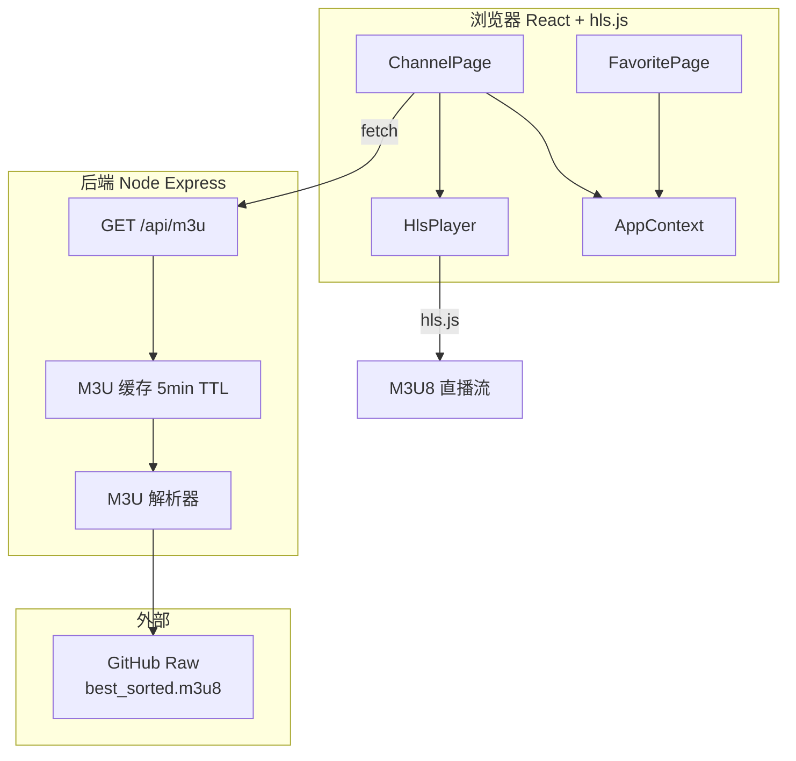

# LPTV M3U 源重构设计规格

## 1. 项目概述

LPTV 电视直播 Web 应用改造：从原有的 iframe + postMessage 代理播放模式，重构为 M3U 源动态拉取 + hls.js 原生播放架构。

### 1.1 核心问题

| 问题 | 原方案 | 新方案 |
|------|--------|--------|
| 频道数据 | 硬编码 84 个频道于 `channels.ts` | 从 M3U 源动态拉取 692 个频道 |
| 播放方案 | iframe 加载 iptv345.com → postMessage 提取视频地址 | hls.js 直接播放 HLS 流 |
| 代理服务器 | HTML 注入脚本、资源代理、API 代理 | 仅做 M3U 拉取 + 解析 + 缓存 |
| 分类 | 固定 `ys`/`ws` 两个分类 | 从 M3U `group-title` 动态提取，前端过滤 |

### 1.2 技术栈变更

| 模块 | 原有 | 改为 |
|------|------|------|
| 播放内核 | iframe + postMessage | hls.js |
| 频道数据 | `channels.ts` 硬编码 | `/api/m3u` 动态 JSON API |
| 后端 | iframe 代理 + 脚本注入 | M3U 拉取 + 解析 + 缓存 |
| M3U 解析 | 无 | 后端正则解析 `#EXTINF` 元数据 |
| 新增服务层 | - | `channelApi.ts`、`channelFilter.ts` |

---

## 2. 架构设计

### 2.1 架构图



### 2.2 数据流

1. 应用启动 → `ChannelPage` 调用 `fetchChannels()`
2. → `GET /api/m3u` → 后端检查缓存（5min TTL）
3. → 缓存过期 → 后端 `fetch` GitHub raw M3U → 正则解析 → 缓存并返回 JSON
4. → 前端 `filterChannels()` 只保留"央视频道"、"卫视频道"两个分组
5. → 用户点击频道 → `selectedChannel.url` 传给 `<HlsPlayer>`
6. → hls.js 直接加载 M3U8 流 → `<video>` 播放

---

## 3. 后端 API 设计

### 3.1 端点定义

| 端点 | 方法 | 参数 | 返回 | 说明 |
|------|------|------|------|------|
| `/api/m3u` | GET | `?refresh=1` (可选) | `Channel[]` JSON | 获取频道列表 |
| `/health` | GET | - | `{status:'ok'}` | 健康检查 |

### 3.2 M3U 源配置

```javascript
const M3U_URL = 'https://raw.githubusercontent.com/zilong7728/Collect-IPTV/refs/heads/main/best_sorted.m3u8'
const CACHE_TTL = 5 * 60 * 1000  // 5 分钟
```

### 3.3 M3U 解析逻辑

```javascript
function parseM3U(text) {
  const channels = []
  const lines = text.split('\n')
  for (let i = 0; i < lines.length; i++) {
    if (!lines[i].startsWith('#EXTINF:')) continue

    const meta = lines[i]
    const urlLine = lines[i + 1]?.trim()
    if (!urlLine || urlLine.startsWith('#')) continue

    const tvgName = meta.match(/tvg-name="(.*?)"/)?.[1] || ''
    const tvgLogo = meta.match(/tvg-logo="(.*?)"/)?.[1] || ''
    const groupTitle = meta.match(/group-title="(.*?)"/)?.[1] || '未分类'
    const displayName = meta.split(',')?.pop()?.trim() || tvgName
    const url = urlLine.split('?')[0]  // clean URL

    channels.push({
      id: `${groupTitle}-${tvgName}`,  // 稳定 key，不受 M3U 条目顺序影响
      name: displayName,
      logo: tvgLogo,
      group: groupTitle,
      url: urlLine,
    })
  }
  return channels
}
```

### 3.4 移除内容

| 移除端点 | 原因 |
|----------|------|
| `GET /proxy/asset/:path` | 不再需要代理 iptv345 静态资源 |
| `ALL /proxy/api/:path` | 不再需要代理 API 请求 |
| `GET /proxy/category` | 不再需要分类页面 |
| `GET /proxy/play` | 不再需要注入脚本提取视频 |
| `INJECT_SCRIPT` | 整个注入脚本逻辑移除 |

---

## 4. 前端数据层

### 4.1 Channel 类型更新

```typescript
export interface Channel {
  id: string        // "央视频道-CCTV1" — group-name 复合 key，唯一且稳定
  name: string      // 频道显示名
  logo: string      // tvg-logo URL
  group: string     // group-title, 如"央视频道"
  url: string       // HLS 直播流地址
}
```

原有 `tid`、`currentProgram`、`isLive`、`category` 字段移除。

### 4.2 channelApi.ts

```typescript
const API_BASE = '/api'  // Vite proxy 转发到 localhost:3000

export async function fetchChannels(refresh = false): Promise<Channel[]> {
  const url = `${API_BASE}/m3u${refresh ? '?refresh=1' : ''}`
  const res = await fetch(url, { signal: AbortSignal.timeout(8000) })
  if (!res.ok) throw new Error(`HTTP ${res.status}`)
  return res.json()
}
```

### 4.3 channelFilter.ts

```typescript
const ALLOWED_GROUPS = ['央视频道', '卫视频道']

export function filterChannels(all: Channel[]): Channel[] {
  return all.filter(c => ALLOWED_GROUPS.includes(c.group))
}

export interface GroupedChannels {
  group: string
  channels: Channel[]
}

export function getGroupedChannels(all: Channel[]): GroupedChannels[] {
  return ALLOWED_GROUPS
    .map(group => ({
      group,
      channels: all.filter(c => c.group === group),
    }))
    .filter(g => g.channels.length > 0)
}
```

---

## 5. HlsPlayer 组件

### 5.1 Props

```typescript
interface HlsPlayerProps {
  url: string
  channelName: string
  channelLogo?: string
  onError?: (err: Error) => void
}
```

### 5.2 生命周期管理

| 阶段 | 行为 |
|------|------|
| `mount` / `url` 变化 | `hls.destroy()` → `new Hls()` → `loadSource(url)` → `attachMedia(video)` |
| `unmount` | `hls.destroy()` → 所有引用置 null |
| 播放错误 | `hls.recoverMediaError()` 自动恢复；失败 3 次 → 显示错误 UI |

### 5.3 错误恢复策略

```typescript
let retryCount = 0
const MAX_RETRIES = 3

hls.on(Hls.Events.ERROR, (event, data) => {
  if (data.fatal) {
    retryCount++
    if (retryCount <= MAX_RETRIES) {
      hls.recoverMediaError()
    } else {
      // 显示错误 UI + 重试按钮
    }
  }
})
```

### 5.4 控制栏

复用现有 auto-hide 逻辑（触摸/鼠标交互 → 显示 → 3s 自动隐藏），显示频道名称 + 返回按钮，不需要线路切换 UI。

---

## 6. 页面层修改

### 6.1 ChannelPage.tsx

| 项目 | 实现 |
|------|------|
| 数据加载 | `useEffect` → `fetchChannels()` → `filterChannels()` |
| 加载状态 | Loading spinner |
| 错误状态 | 错误提示 + "重试"按钮 |
| 空状态 | "暂无可用频道" |
| 分类折叠 | 保持不变（央视频道 / 卫视频道两个折叠面板） |
| 播放器 | 选中频道后右侧渲染 `<HlsPlayer>` |
| 搜索 | 保持不变（按 `name` 过滤） |

### 6.2 FavoritePage.tsx

- 收藏 key 使用 Channel.id（`group-name` 复合 key，如 `央视频道-CCTV1`），不受 M3U 条目顺序影响
- 频道列表从 AppContext 的 channels 获取（与 ChannelPage 共享数据）
- 收藏的频道在刷新后如果 id 不存在（源已移除该频道），自动从收藏中清理

### 6.3 App.tsx

- 管理 `channels: Channel[]` 全局状态（提升到 AppContext 或 App 组件级别）
- 应用启动时自动调用 `fetchChannels()`
- 通过 Context 或 props 下发到 ChannelPage / FavoritePage

### 6.4 TvModePage.tsx

- 现有 iframe 播放 → 改为使用 `<HlsPlayer>` 或内嵌 hls.js
- 频道列表改为从动态数据读取（不再依赖 `channels.ts`）

---

## 7. 文件变更清单

### 新建
- `src/services/channelApi.ts`
- `src/utils/channelFilter.ts`
- `src/components/Player/HlsPlayer.tsx`

### 重写
- `proxy-server.cjs`
- `src/pages/ChannelPage.tsx`
- `src/pages/TvModePage.tsx`

### 修改
- `src/types/index.ts` — Channel 类型更新
- `src/components/Player/index.ts` — 导出 HlsPlayer
- `vite.config.ts` — 添加 dev proxy
- `src/App.tsx` — 频道列表全局共享
- `src/pages/FavoritePage.tsx` — 动态频道列表
- `package.json` — 添加 hls.js 依赖
- `src/context/AppContext.tsx` — 新增 channels 和 loadChannels 状态/方法

### 删除
- `src/data/channels.ts`
- `src/components/Player/IPTVPlayer.tsx`
- `src/components/Player/ProxyPlayer.tsx`
- `src/utils/iptv.ts`
- 依赖 `cheerio`（从 package.json 移除）
- 依赖 `axios`（从 package.json 移除，改用 fetch）

---

## 8. 开发环境

### 8.1 Vite dev proxy

```typescript
// vite.config.ts
server: {
  proxy: {
    '/api': {
      target: 'http://localhost:3000',
      changeOrigin: true,
    }
  }
}
```

### 8.2 启动方式

```bash
# 终端 1：后端
node proxy-server.cjs

# 终端 2：前端
npm run dev
```

---

## 9. 错误处理与边缘情况

| 场景 | 处理方式 |
|------|----------|
| 后端未启动 | `fetchChannels()` 超时 8s → 显示"后端服务未连接" + 重试按钮 |
| M3U 源 404 | 后端返回 `{error: "M3U source unavailable"}` → 前端显示错误 |
| 视频流 403/404 | hls.js 自动恢复 3 次 → 显示"播放失败" + 重试按钮 |
| 频道切换 | 旧 Hls 实例 `destroy()` → loading → 新实例加载 |
| M3U 格式变化 | 正则解析容错：无法解析的行跳过，不中断整体流程 |
| Empty state | 过滤后无频道 → 显示"暂无频道数据" |
| 收藏频道失效 | 刷新后对比 id，不存在的自动清理 |
| 网络断开 | `window.addEventListener('offline', ...)` 显示断网提示 |

---

## 10. 后续可扩展

- **多 M3U 源切换**：后端支持配置多源，前端提供源选择 UI
- **线路切换**：M3U 中同一频道可能有多个 URL（不同 quality），HlsPlayer 可扩展线路选择
- **频道有效性检测**：后端定时探测各频道 M3U8 是否可访问，标记无效频道
- **PWA**：Service Worker 缓存频道列表，离线时仍可浏览
